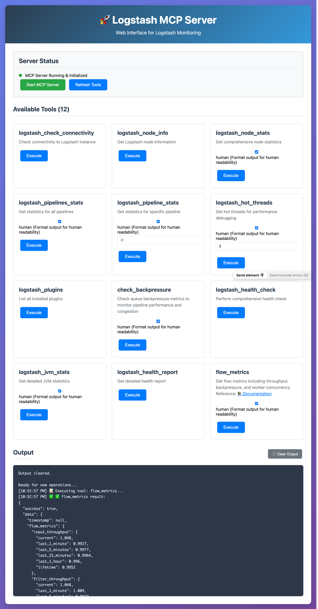

# IMPORTANT
This repository is vibe coded, AI generated and no tested properly. Use it with your own risk.

# Logstash MCP Server

A Model Context Protocol (MCP) server for interacting with Logstash instances. This server provides comprehensive tools for monitoring, configuration management, and pipeline operations.

## Web UI

The project includes a web-based user interface for easy interaction with your Logstash instance.

### Running the Web UI

1. Start the web interface:
```bash
python3 web_ui.py
```

2. Open your browser and navigate to:
```
http://localhost:5001
```



### Web UI Features

The web interface provides:
- **Interactive Dashboard**: Visual interface to access all Logstash monitoring tools
- **Real-time Monitoring**: Check connectivity, node stats, and pipeline performance
- **Health Analysis**: Comprehensive health checks with visual feedback
- **Pipeline Management**: View statistics for individual or all pipelines
- **Performance Debugging**: Hot threads analysis and JVM statistics
- **Plugin Management**: Browse installed Logstash plugins

### Web UI Configuration

The web UI uses the same configuration as the MCP server:
- Default Logstash URL: `http://localhost:9600`
- Override with: `LOGSTASH_API_BASE` environment variable
- Web interface runs on: `http://localhost:5001`

Example with custom Logstash URL:
```bash
export LOGSTASH_API_BASE="http://your-logstash-host:9600"
python3 web_ui.py
```

## Features

### Monitoring Tools
- **Node Information**: Get Logstash version, build info, and settings
- **Node Statistics**: JVM, process, and pipeline metrics
- **Pipeline Statistics**: Monitor individual or all pipeline performance
- **Hot Threads**: Debug performance issues with thread analysis
- **Health Check**: Comprehensive health assessment with recommendations
- **Connectivity Check**: Verify connection to Logstash with detailed diagnostics

### Management Tools
- **Pipeline Reload**: Reload specific pipeline configurations
- **Plugin Listing**: View all installed Logstash plugins
- **JVM Statistics**: Detailed memory and garbage collection metrics
- **Grok Patterns**: List available Grok patterns for log parsing

## Installation

1. Install dependencies:
```bash
pip install -r requirements.txt
```

2. Set up environment variables (optional):
```bash
export LOGSTASH_API_BASE="http://your-logstash-host:9600"
```

## Configuration

The server uses the following default configuration:
- **Logstash Host**: localhost
- **Logstash Port**: 9600
- **API Base URL**: http://localhost:9600

You can override the API base URL using the `LOGSTASH_API_BASE` environment variable.

## Available Tools (12 Total)

### `logstash_check_connectivity`
Check connectivity to the Logstash instance with detailed connection status, response times, and error handling.
- Returns: Connection status, URL, version, host, response time, error details, and troubleshooting suggestions

### `logstash_node_info`
Get Logstash node information including version, build info, and settings.

### `logstash_node_stats`
Get comprehensive node statistics including JVM, process, and pipeline metrics.
- Parameters: `human` (boolean, default: true)

### `logstash_pipelines_stats`
Get statistics for all Logstash pipelines.
- Parameters: `human` (boolean, default: true)

### `logstash_pipeline_stats`
Get statistics for a specific pipeline.
- Parameters: `id` (string, required), `human` (boolean, default: true)

### `logstash_hot_threads`
Get hot threads information for debugging performance issues.
- Parameters: `threads` (integer, default: 3), `human` (boolean, default: true)

### `logstash_plugins`
List all installed Logstash plugins.

### `check_backpressure`
Check queue backpressure metrics to monitor pipeline performance and congestion.
- Parameters: `human` (boolean, default: true)

### `logstash_health_check`
Perform comprehensive health check with analysis and recommendations.

### `logstash_jvm_stats`
Get detailed JVM statistics for memory analysis.
- Parameters: `human` (boolean, default: true)

### `logstash_health_report`
Get detailed health report from Logstash.

### `flow_metrics`
Get detailed flow metrics including throughput, backpressure, and worker concurrency.
- Parameters: `human` (boolean, default: true)

## Health Check Analysis

The health check tool analyzes:
- **Connectivity Verification**: Tests connection to Logstash before other checks
- **JVM Memory Usage**: Warns if heap usage exceeds 80%
- **Pipeline Performance**: Detects pipelines with filtered but no output events
- **Queue Usage**: Identifies large queue sizes that may impact performance

## Quick Start Commands

After starting the server with `python3 logstash_mcp_server.py`, use these JSON-RPC commands:

### 1. Initialize (Required First)
```json
{"jsonrpc": "2.0", "id": 0, "method": "initialize", "params": {"protocolVersion": "2024-11-05", "capabilities": {}, "clientInfo": {"name": "test-client", "version": "1.0.0"}}}
```

### 2. Check Connectivity
```json
{"jsonrpc": "2.0", "id": 1, "method": "tools/call", "params": {"name": "logstash_check_connectivity", "arguments": {}}}
```

### 3. Health Check
```json
{"jsonrpc": "2.0", "id": 2, "method": "tools/call", "params": {"name": "logstash_health_check", "arguments": {}}}
```

### 4. List All Tools
```json
{"jsonrpc": "2.0", "id": 3, "method": "tools/list"}
```

### 5. Get Node Info
```json
{"jsonrpc": "2.0", "id": 4, "method": "tools/call", "params": {"name": "logstash_node_info", "arguments": {}}}
```

## Usage Examples

### Basic Health Check
```python
# The MCP server will automatically analyze:
# - JVM memory usage
# - Pipeline performance
# - Queue statistics
# - Provide recommendations for optimization
```

### Pipeline Monitoring
```python
# Monitor specific pipeline performance
# Get detailed statistics for troubleshooting
# Track event processing rates and errors
```

### Performance Debugging
```python
# Use hot threads analysis to identify bottlenecks
# Monitor JVM statistics for memory issues
# Track pipeline queue usage
```

## Integration with ELK Stack

This MCP server is designed to work alongside Elasticsearch diagnostics and can help:
- Monitor Logstash performance feeding into your Elasticsearch cluster
- Identify pipeline bottlenecks that may contribute to indexing delays
- Optimize Logstash configuration for better cluster performance

Based on your Elasticsearch cluster analysis showing high shard counts, ensure your Logstash pipelines are optimized for efficient indexing patterns.

## Error Handling

The server includes comprehensive error handling for:
- Connection failures to Logstash API
- Invalid pipeline IDs
- API response errors
- Network timeouts
- Detailed error messages with troubleshooting suggestions

## Testing

Run the test suite to verify everything works:
```bash
python3 test_mcp_server.py
```

The test suite includes:
- Server initialization tests
- Tool listing verification
- Mocked health check tests
- Error handling validation

## Security Considerations

- The server connects to Logstash API endpoints
- Ensure proper network security between MCP server and Logstash
- Consider authentication if your Logstash instance requires it
- Monitor API access logs for security auditing
